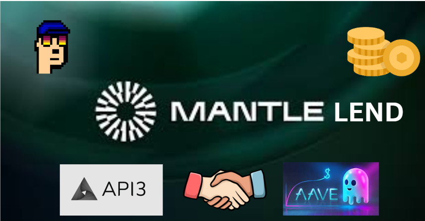

**Mantle Lend**

Borrow, Repay, and Loan with Confidence. Elevate Your DeFi Journey with Mantle Lend.

Link to the Fork - https://github.com/kamaleth/aave-v3-on-mantle

## Description

Lending on Mantle using Aave and API3 

Mantle Lend is a decentralized lending protocol built on the Mantle Network, offering secure and efficient lending services on the EVM Layer2 blockchain. Forked from a leading and well-established EVM lending protocol, Mantle Lend brings robust lending functionalities and a high standard of security to the Mantle ecosystem.

With Mantle Lend, users can seamlessly access lending services in a decentralized manner, allowing them to borrow and lend digital assets securely and efficiently. Leveraging the unique capabilities of Mantle Network, the protocol provides a reliable and scalable solution for loan origination, tracking, and repayment.

**Features:**

1. Borrowing and Lending: Users can easily borrow digital assets by providing suitable collateral and avail themselves of lending services to earn interest on their deposited assets.

2. Robust Security: Mantle Lend prioritizes the security of users' funds and data. It implements industry-standard security measures and smart contract audits to ensure a high level of protection.

3. Seamless User Experience: The dAPIs provided by Mantle Network enable smooth and decentralized interaction with the lending protocol. Users can seamlessly access and operate Mantle Lend through user-friendly interfaces or integrate it into their own applications.

4. Cross-Chain Compatibility: Mantle Lend is compatible with various blockchain networks, allowing users to leverage assets from different ecosystems and access lending services across multiple chains.

## How it Works

Mantle Lend operates as a decentralized lending marketplace on the Mantle Network. Users can participate in the lending ecosystem by following these simple steps:

1. Connect Wallet: Users connect their preferred Ethereum wallet to the Mantle Lend dApp, ensuring a secure and personalized experience.

2. Collateral Lock: Borrowers lock their collateral assets in the smart contracts, providing suitable collateral to secure their loans.

3. Loan Origination: Borrowers request a loan by specifying the desired loan amount and term. The protocol automatically matches borrowers with suitable lenders based on predefined parameters.

4. Lending and Interest: Lenders fund the loan by lending their assets to borrowers. They earn interest on their lent assets, providing an opportunity to earn passive income.

5. Repayment: Borrowers repay their loans within the specified loan term, including principal and interest. Upon successful repayment, the collateral is released to the borrower, and lenders receive their principal and interest payments.

## Get Started

To start using Mantle Lend, follow these steps:

1. Install MetaMask: Install the MetaMask browser extension and set up an Ethereum wallet.

2. Connect to Mantle Network: Switch your MetaMask network to the Mantle Network to interact with Mantle Lend on the EVM Layer2 blockchain.

3. Access Mantle Lend: Visit the Mantle Lend website or access it through a decentralized application (dApp) browser. Connect your MetaMask wallet to access the lending functionalities.

4. Borrow or Lend: Choose whether you want to borrow or lend digital assets. If borrowing, provide suitable collateral and specify your loan parameters. If lending, choose the assets you want to lend and the desired interest rate.

5. Interact with dAPIs: Mantle Lend integrates with Mantle's dAPIs, enabling decentralized user interaction. You can seamlessly interact with the lending protocol using the provided APIs, ensuring a secure and decentralized experience.

Start participating in the decentralized lending ecosystem with Mantle Lend and enjoy the benefits of borrowing and lending in a secure and efficient manner.

## Security

Mantle Lend takes security seriously and follows best practices to ensure the safety of user funds and data. The smart contracts powering Mantle Lend have undergone rigorous audits and security checks. However, as with any DeFi application, users should exercise caution and do their own research before participating.

## Feedback and Contributions

Mantle Lend is an open-source project, and we welcome feedback and contributions from the community. If you encounter any issues or have suggestions for improvement, please reach out to us through our official communication channels.

Join us in revolutionizing decentralized lending with Mantle Lend and experience a new era of secure and efficient lending on the Mantle Network.